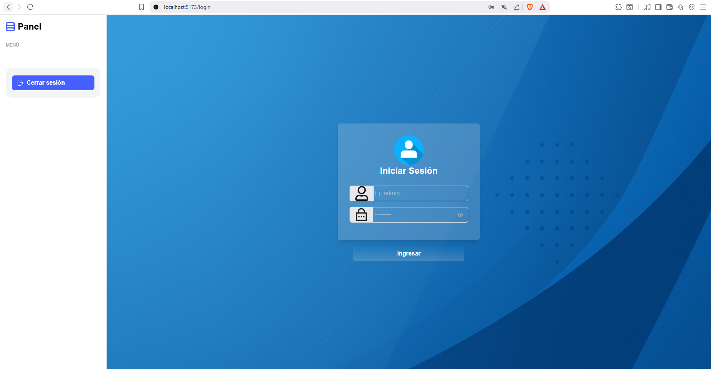

# MigracionCliente

MigracionCliente is a desktop application built with Electron, Vite, React, and TypeScript for the frontend, and a Node.js backend with Express and MySQL for data management. The application implements secure authentication using JSON Web Tokens (JWT) and cookies, providing a robust solution for managing migrations with a modern user interface.

## Table of Contents
- [Features](#features)
- [Tech Stack](#tech-stack)
- [Prerequisites](#prerequisites)
- [Installation](#installation)
- [Running the Application](#running-the-application)
- [Building for Production](#building-for-production)
- [Project Structure](#project-structure)
- [Authentication](#authentication)
- [Email Notifications](#email-notifications)
- [Contributing](#contributing)
- [License](#license)

## Features
- **Modern UI**: Built with React, Tailwind CSS, and Headless UI for a responsive and accessible interface.
- **Data Visualization**: Integrated with react-apexcharts and react-jvectormap for dynamic charts and maps.
- **Secure Authentication**: Uses JWT and cookies for secure user authentication.
- **Database Management**: MySQL backend with automated backups via mysqldump.
- **Scheduled Tasks**: Node-cron for automated task scheduling.
- **Reporting**: PDF report generation using jsreport and handlebars.
- **Email Notifications**: Nodemailer for sending emails with configurable settings.
- **Cross-Platform**: Electron-based desktop application compatible with Windows, macOS, and Linux.

## Tech Stack
### Frontend
- **Vite**: Fast build tool for development and production.
- **React**: Component-based UI library (v19.1.0).
- **TypeScript**: Typed JavaScript for improved maintainability.
- **Tailwind CSS**: Utility-first CSS framework for styling.
- **Headless UI**: Accessible UI components.
- **Heroicons & Lucide Icons**: Icon libraries for UI elements.
- **React Router**: Client-side routing for navigation.
- **Zustand**: Lightweight state management.
- **Electron**: Framework for building cross-platform desktop apps.

### Backend
- **Node.js & Express**: Server-side framework for API development.
- **MySQL**: Relational database for data storage.
- **JWT & bcryptjs**: Secure authentication with tokens and password hashing.
- **Cookie-Parser**: Middleware for handling cookies.
- **Nodemailer**: Email sending functionality.
- **jsreport**: Report generation with Handlebars templates.
- **node-cron**: Task scheduling for automated processes.
- **dotenv**: Environment variable management.

## Prerequisites
- **Node.js**: v18 or higher
- **MySQL**: v8 or higher
- **Git**: For version control
- **Electron**: For desktop application development
- **npm**: Package manager (included with Node.js)
- **XAMPP**: Optional, for running MySQL and Apache locally

## Installation
1. **Clone the repository**:
   ```bash
   git clone https://github.com/yourusername/migracioncliente.git
   cd migracioncliente
   ```

2. **Install frontend dependencies**:
   ```bash
   cd client
   npm install
   ```

3. **Install backend dependencies**:
   ```bash
   cd ../backend
   npm install
   ```

4. **Set up environment variables**:
   - Create a `.env` file in the backend directory with the following structure:
     ```plaintext
     MAIL_HOST=smtp.gmail.com
     MAIL_PORT=465
     MAIL_USER=test@gmail.com
     MAIL_PASS=your-app-specific-password
     NOTIFY_TO=testtonotify@gmail.com
     DB_HOST=localhost
     HOST=127.0.0.1
     PORT=3000
     DB_USER=root
     DB_PASSWORD=
     DB_NAME=testrespaldo1
     ```
   - Replace `MAIL_USER`, `MAIL_PASS`, and `NOTIFY_TO` with your actual email credentials and recipient address.

5. **Set up MySQL database**:
   - Use XAMPP or another MySQL server to start MySQL.
   - Create a database named `testrespaldo1`.
   - Import the initial database schema and stored procedures from `backups/BackupInicial.sql`:
     ```bash
     mysql -u root -p testrespaldo1 < backups/BackupInicial.sql
     ```
   - After importing, you can log in with the credentials:
     - **Login**: usuarioAdmin
     - **Password**: 123456

## Running the Application
1. **Start the MySQL and Apache servers** (if using XAMPP):
   - Launch XAMPP and start the MySQL and Apache modules.

2. **Start the backend**:
   ```bash
   cd backend
   npm install
   node server.js
   ```
   Alternatively, use `nodemon server.js` for automatic server restarts during development.

3. **Start the frontend in development mode**:
   ```bash
   cd client
   npm run dev
   ```

4. **Run the Electron app**:
   ```bash
   cd client
   npm run electron
   ```

5. **Preview the production build**:
   ```bash
   cd client
   npm run preview
   ```

## Building for Production
1. **Build the frontend**:
   ```bash
   cd client
   npm run build
   ```

2. **Package the Electron app**:
   - Update `client/src/main.tsx` to use `HashRouter` instead of `BrowserRouter`:
     ```tsx
     import { HashRouter } from 'react-router-dom';
     ReactDOM.createRoot(document.getElementById('root')!).render(
       <React.StrictMode>
         <HashRouter>
           <App />
         </HashRouter>
       </React.StrictMode>,
     );
     ```
   - Update `client/src/axiosConfig.ts` to use `#/login` for redirection:
     ```tsx
     if (status === 401 && !endpoint.includes('/auth/login')) {
       localStorage.removeItem('usuario');
       window.location.href = '#/login';
     }
     ```
   - Build the Electron executable:
     ```bash
     cd client
     npm run dist
     ```
   - The output will be in the `dist` folder, ready for distribution.

## Project Structure
```
migracioncliente/
├── client/                    # Frontend code
│   ├── electron/              # Electron main process
│   ├── src/                   # React components, pages, and assets
│   ├── vite.config.ts         # Vite configuration
│   └── package.json           # Frontend dependencies
├── backend/                   # Backend code
│   ├── src/                   # Express routes, controllers, and services
│   ├── backups/               # Database backup files (BackupInicial.sql)
│   ├── .env                   # Environment variables
│   └── package.json           # Backend dependencies
└── README.md                  # Project documentation
```

## Authentication
- **Frontend**: Uses `axios` for API requests, with JWT stored in cookies for secure communication.
- **Backend**: Implements JWT-based authentication with `jsonwebtoken` and password hashing with `bcryptjs`.
- **Cookies**: Managed with `cookie-parser` for session handling.
- **Default Credentials**: After importing `BackupInicial.sql`, use:
  - **Login**: usuarioAdmin
  - **Password**: 123456

## Email Notifications
- Configure email settings in the `.env` file as shown above.
- Update `backend/helpers/email.js` to ensure correct email configuration:
  ```javascript
  let mailOptions = {
    from: "test@gmail.com",
    to: to,
    subject: subject,
    html,
    text: html.replace(/<[^>]+>/g, "")
  };
  ```
- Ensure `MAIL_USER`, `MAIL_PASS`, and `NOTIFY_TO` in `.env` are set correctly for scheduled sales notifications to work.

## Contributing
1. Fork the repository.
2. Create a new branch (`git checkout -b feature/your-feature`).
3. Commit your changes (`git commit -m 'Add your feature'`).
4. Push to the branch (`git push origin feature/your-feature`).
5. Open a pull request.

## Project Screenshots 

LOGIN PAGE

